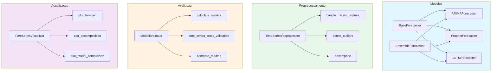
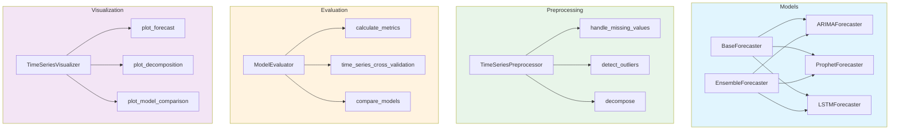

# Time Series Forecasting Engine

Motor de previsao de series temporais com ARIMA, Prophet, LSTM e ensemble. Inclui preprocessamento, validacao cruzada temporal e visualizacao de previsoes.

Time series forecasting engine with ARIMA, Prophet, LSTM, and ensemble methods. Includes preprocessing, temporal cross-validation, and forecast visualization.

[](https://python.org)
[](https://tensorflow.org)
[](LICENSE)

[Portugues](#portugues) | [English](#english)

---

## Portugues

### Visao Geral

Framework Python para previsao de series temporais que implementa quatro modelos com uma interface comum (`BaseForecaster`):

- **ARIMAForecaster** — wrapper sobre `statsmodels.SARIMAX` com suporte a componentes sazonais
- **ProphetForecaster** — wrapper sobre `prophet.Prophet` com customizacao de sazonalidade
- **LSTMForecaster** — rede LSTM com TensorFlow/Keras, escalonamento e janelas deslizantes
- **EnsembleForecaster** — combina previsoes de multiplos modelos (media simples, ponderada, mediana)

Modulos auxiliares:
- **TimeSeriesPreprocessor** — tratamento de valores ausentes, deteccao de outliers, decomposicao sazonal
- **ModelEvaluator** — metricas (MAE, MSE, RMSE, MAPE, SMAPE), validacao cruzada temporal, comparacao de modelos
- **TimeSeriesVisualizer** — graficos de previsao, decomposicao, residuos, comparacao de modelos

### Arquitetura



### Modelos

| Modelo | Backend | Descricao |
|--------|---------|-----------|
| `ARIMAForecaster` | statsmodels SARIMAX | ARIMA com componentes sazonais opcionais |
| `ProphetForecaster` | Facebook Prophet | Sazonalidade aditiva/multiplicativa, feriados |
| `LSTMForecaster` | TensorFlow/Keras | Rede LSTM com MinMaxScaler e janelas deslizantes |
| `EnsembleForecaster` | Nativo | Combina previsoes via media, ponderada ou mediana |

### Inicio Rapido

```bash
# Clonar o repositorio
git clone https://github.com/galafis/time-series-forecasting-engine.git
cd time-series-forecasting-engine

# Criar ambiente virtual
python -m venv venv
source venv/bin/activate  # Windows: venv\Scripts\activate

# Instalar dependencias
pip install -r requirements.txt

# Executar o exemplo completo
python examples/complete_example.py
```

### Uso

```python
from src.models import ARIMAForecaster, EnsembleForecaster
from src.preprocessing import TimeSeriesPreprocessor
from src.evaluation import ModelEvaluator

# Preprocessamento
preprocessor = TimeSeriesPreprocessor()
data_clean = preprocessor.handle_missing_values(data, method='interpolate')

# Treinar modelo
model = ARIMAForecaster(order=(1, 1, 1))
model.fit(train_data)
predictions = model.predict(steps=30)

# Avaliar
evaluator = ModelEvaluator()
metrics = evaluator.calculate_metrics(actual, predictions)
```

### Testes

```bash
pytest
pytest --cov=src --cov-report=term-missing
```

### Estrutura do Projeto

```
time-series-forecasting-engine/
├── src/
│   ├── __init__.py
│   ├── models/
│   │   ├── __init__.py
│   │   ├── base_forecaster.py        # ABC com fit/predict/predict_with_intervals
│   │   ├── arima_forecaster.py       # SARIMAX wrapper
│   │   ├── prophet_forecaster.py     # Prophet wrapper
│   │   ├── lstm_forecaster.py        # TensorFlow LSTM
│   │   └── ensemble_forecaster.py    # Combinacao de modelos
│   ├── preprocessing/
│   │   ├── __init__.py
│   │   └── preprocessor.py           # Missing values, outliers, decomposicao
│   ├── evaluation/
│   │   ├── __init__.py
│   │   └── evaluator.py              # Metricas, CV temporal, comparacao
│   └── visualization/
│       ├── __init__.py
│       └── visualizer.py             # Graficos matplotlib/plotly
├── tests/
│   ├── test_models.py                # Testes dos 4 modelos
│   ├── test_preprocessing.py         # Testes de preprocessamento
│   └── test_evaluation.py            # Testes de metricas e CV
├── examples/
│   └── complete_example.py           # Pipeline completo de exemplo
├── requirements.txt
├── setup.py
└── LICENSE
```

### Stack Tecnologica

| Tecnologia | Uso real |
|------------|----------|
| **Python** | Linguagem principal |
| **statsmodels** | ARIMA/SARIMAX |
| **Prophet** | Facebook Prophet |
| **TensorFlow/Keras** | LSTM |
| **scikit-learn** | MinMaxScaler, train_test_split |
| **pandas/numpy** | Manipulacao de dados |
| **matplotlib/plotly** | Visualizacao |
| **scipy** | Teste de estacionariedade (ADF), z-score |
| **seaborn** | Graficos complementares |

---

## English

### Overview

Python framework for time series forecasting that implements four models with a common interface (`BaseForecaster`):

- **ARIMAForecaster** — wrapper over `statsmodels.SARIMAX` with seasonal component support
- **ProphetForecaster** — wrapper over `prophet.Prophet` with seasonality customization
- **LSTMForecaster** — LSTM network with TensorFlow/Keras, scaling, and sliding windows
- **EnsembleForecaster** — combines predictions from multiple models (simple average, weighted, median)

Auxiliary modules:
- **TimeSeriesPreprocessor** — missing value handling, outlier detection, seasonal decomposition
- **ModelEvaluator** — metrics (MAE, MSE, RMSE, MAPE, SMAPE), temporal cross-validation, model comparison
- **TimeSeriesVisualizer** — forecast plots, decomposition, residuals, model comparison charts

### Architecture



### Models

| Model | Backend | Description |
|-------|---------|-------------|
| `ARIMAForecaster` | statsmodels SARIMAX | ARIMA with optional seasonal components |
| `ProphetForecaster` | Facebook Prophet | Additive/multiplicative seasonality, holidays |
| `LSTMForecaster` | TensorFlow/Keras | LSTM network with MinMaxScaler and sliding windows |
| `EnsembleForecaster` | Native | Combines predictions via mean, weighted, or median |

### Quick Start

```bash
# Clone the repository
git clone https://github.com/galafis/time-series-forecasting-engine.git
cd time-series-forecasting-engine

# Create virtual environment
python -m venv venv
source venv/bin/activate  # Windows: venv\Scripts\activate

# Install dependencies
pip install -r requirements.txt

# Run the complete example
python examples/complete_example.py
```

### Usage

```python
from src.models import ARIMAForecaster, EnsembleForecaster
from src.preprocessing import TimeSeriesPreprocessor
from src.evaluation import ModelEvaluator

# Preprocessing
preprocessor = TimeSeriesPreprocessor()
data_clean = preprocessor.handle_missing_values(data, method='interpolate')

# Train model
model = ARIMAForecaster(order=(1, 1, 1))
model.fit(train_data)
predictions = model.predict(steps=30)

# Evaluate
evaluator = ModelEvaluator()
metrics = evaluator.calculate_metrics(actual, predictions)
```

### Testing

```bash
pytest
pytest --cov=src --cov-report=term-missing
```

### Project Structure

```
time-series-forecasting-engine/
├── src/
│   ├── __init__.py
│   ├── models/
│   │   ├── __init__.py
│   │   ├── base_forecaster.py        # ABC with fit/predict/predict_with_intervals
│   │   ├── arima_forecaster.py       # SARIMAX wrapper
│   │   ├── prophet_forecaster.py     # Prophet wrapper
│   │   ├── lstm_forecaster.py        # TensorFlow LSTM
│   │   └── ensemble_forecaster.py    # Model combination
│   ├── preprocessing/
│   │   ├── __init__.py
│   │   └── preprocessor.py           # Missing values, outliers, decomposition
│   ├── evaluation/
│   │   ├── __init__.py
│   │   └── evaluator.py              # Metrics, temporal CV, comparison
│   └── visualization/
│       ├── __init__.py
│       └── visualizer.py             # matplotlib/plotly charts
├── tests/
│   ├── test_models.py                # Tests for all 4 models
│   ├── test_preprocessing.py         # Preprocessing tests
│   └── test_evaluation.py            # Metrics and CV tests
├── examples/
│   └── complete_example.py           # Complete example pipeline
├── requirements.txt
├── setup.py
└── LICENSE
```

### Tech Stack

| Technology | Actual usage |
|------------|-------------|
| **Python** | Core language |
| **statsmodels** | ARIMA/SARIMAX |
| **Prophet** | Facebook Prophet |
| **TensorFlow/Keras** | LSTM |
| **scikit-learn** | MinMaxScaler, train_test_split |
| **pandas/numpy** | Data manipulation |
| **matplotlib/plotly** | Visualization |
| **scipy** | Stationarity test (ADF), z-score |
| **seaborn** | Supplementary charts |

---

### Author / Autor

**Gabriel Demetrios Lafis**
- GitHub: [@galafis](https://github.com/galafis)
- LinkedIn: [Gabriel Demetrios Lafis](https://linkedin.com/in/gabriel-demetrios-lafis)

### License / Licenca

MIT License - see [LICENSE](LICENSE) for details.
