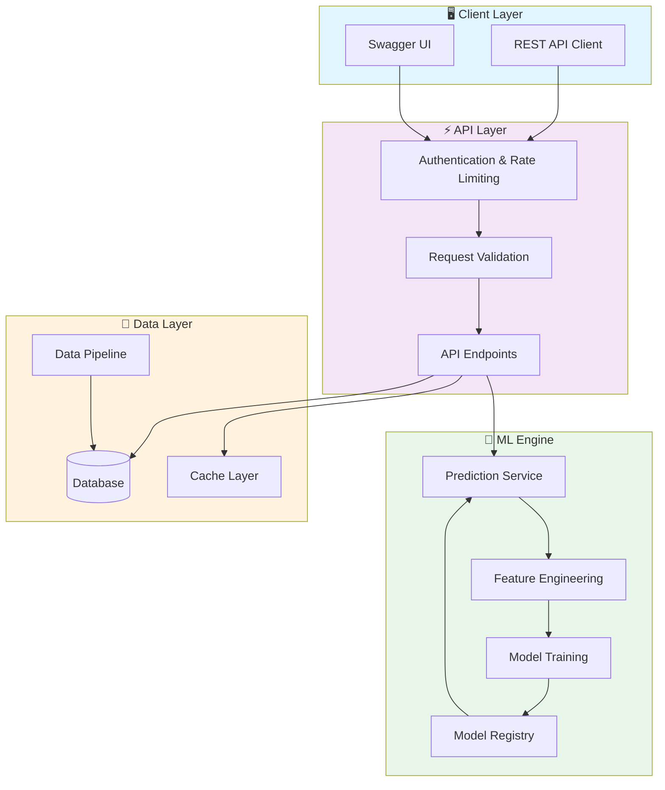
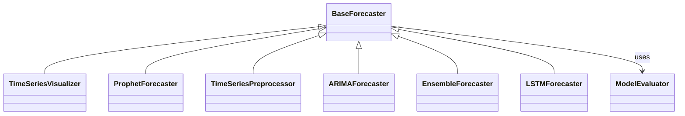

# 🚀 Time Series Forecasting Engine

> Scalable time series forecasting engine supporting ARIMA, Prophet, LSTM, and ensemble methods. Features automated model selection, cross-validation, and forecast evaluation.

[](https://img.shields.io/badge/)
[](https://img.shields.io/badge/)
[](https://img.shields.io/badge/)
[](https://img.shields.io/badge/)
[](https://img.shields.io/badge/)
[](https://img.shields.io/badge/)
[](https://img.shields.io/badge/)
[](LICENSE)

[English](#english) | [Português](#português)

---

## English

### 🎯 Overview

**Time Series Forecasting Engine** is a production-grade Python application that showcases modern software engineering practices including clean architecture, comprehensive testing, containerized deployment, and CI/CD readiness.

The codebase comprises **3,270 lines** of source code organized across **18 modules**, following industry best practices for maintainability, scalability, and code quality.

### ✨ Key Features

- **🏗️ Object-Oriented**: 14 core classes with clean architecture
- **📐 Clean Architecture**: Modular design with clear separation of concerns
- **🧪 Test Coverage**: Unit and integration tests for reliability
- **📚 Documentation**: Comprehensive inline documentation and examples
- **🔧 Configuration**: Environment-based configuration management

### 🏗️ Architecture





### 🚀 Quick Start

#### Prerequisites

- Python 3.12+
- pip (Python package manager)

#### Installation

```bash
# Clone the repository
git clone https://github.com/galafis/time-series-forecasting-engine.git
cd time-series-forecasting-engine

# Create and activate virtual environment
python -m venv venv
source venv/bin/activate  # On Windows: venv\Scripts\activate

# Install dependencies
pip install -r requirements.txt
```

#### Running

```bash
# Run the application
python src/main.py
```

### 🧪 Testing

```bash
# Run all tests
pytest

# Run with coverage report
pytest --cov --cov-report=html

# Run specific test module
pytest tests/test_main.py -v

# Run with detailed output
pytest -v --tb=short
```

### 📁 Project Structure

```
time-series-forecasting-engine/
├── config/        # Configuration
├── data/
│   ├── processed/
│   └── raw/
├── docs/          # Documentation
│   └── architecture.md
├── examples/
│   └── complete_example.py
├── models/        # Data models
├── notebooks/
├── src/          # Source code
│   ├── evaluation/
│   │   ├── README.md
│   │   ├── __init__.py
│   │   └── evaluator.py
│   ├── models/        # Data models
│   │   ├── README.md
│   │   ├── __init__.py
│   │   ├── arima_forecaster.py
│   │   ├── base_forecaster.py
│   │   ├── ensemble_forecaster.py
│   │   ├── lstm_forecaster.py
│   │   └── prophet_forecaster.py
│   ├── preprocessing/
│   │   ├── README.md
│   │   ├── __init__.py
│   │   └── preprocessor.py
│   ├── visualization/
│   │   ├── README.md
│   │   ├── __init__.py
│   │   └── visualizer.py
│   └── __init__.py
├── tests/         # Test suite
│   ├── test_evaluation.py
│   ├── test_models.py
│   └── test_preprocessing.py
├── CONTRIBUTING.md
├── LICENSE
├── README.md
├── requirements.txt
└── setup.py
```

### 🛠️ Tech Stack

| Technology | Description | Role |
|------------|-------------|------|
| **Python** | Core Language | Primary |
| **Gin** | Go web framework | Framework |
| **NumPy** | Numerical computing | Framework |
| **Pandas** | Data manipulation library | Framework |
| **Plotly** | Interactive visualization | Framework |
| **scikit-learn** | Machine learning library | Framework |
| **TensorFlow** | Deep learning framework | Framework |

### 🤝 Contributing

Contributions are welcome! Please feel free to submit a Pull Request. For major changes, please open an issue first to discuss what you would like to change.

1. Fork the project
2. Create your feature branch (`git checkout -b feature/AmazingFeature`)
3. Commit your changes (`git commit -m 'Add some AmazingFeature'`)
4. Push to the branch (`git push origin feature/AmazingFeature`)
5. Open a Pull Request

### 📄 License

This project is licensed under the MIT License - see the [LICENSE](LICENSE) file for details.

### 👤 Author

**Gabriel Demetrios Lafis**
- GitHub: [@galafis](https://github.com/galafis)
- LinkedIn: [Gabriel Demetrios Lafis](https://linkedin.com/in/gabriel-demetrios-lafis)

---

## Português

### 🎯 Visão Geral

**Time Series Forecasting Engine** é uma aplicação Python de nível profissional que demonstra práticas modernas de engenharia de software, incluindo arquitetura limpa, testes abrangentes, implantação containerizada e prontidão para CI/CD.

A base de código compreende **3,270 linhas** de código-fonte organizadas em **18 módulos**, seguindo as melhores práticas do setor para manutenibilidade, escalabilidade e qualidade de código.

### ✨ Funcionalidades Principais

- **🏗️ Object-Oriented**: 14 core classes with clean architecture
- **📐 Clean Architecture**: Modular design with clear separation of concerns
- **🧪 Test Coverage**: Unit and integration tests for reliability
- **📚 Documentation**: Comprehensive inline documentation and examples
- **🔧 Configuration**: Environment-based configuration management

### 🏗️ Arquitetura


### 🚀 Início Rápido

#### Prerequisites

- Python 3.12+
- pip (Python package manager)

#### Installation

```bash
# Clone the repository
git clone https://github.com/galafis/time-series-forecasting-engine.git
cd time-series-forecasting-engine

# Create and activate virtual environment
python -m venv venv
source venv/bin/activate  # On Windows: venv\Scripts\activate

# Install dependencies
pip install -r requirements.txt
```

#### Running

```bash
# Run the application
python src/main.py
```

### 🧪 Testing

```bash
# Run all tests
pytest

# Run with coverage report
pytest --cov --cov-report=html

# Run specific test module
pytest tests/test_main.py -v

# Run with detailed output
pytest -v --tb=short
```

### 📁 Estrutura do Projeto

```
time-series-forecasting-engine/
├── config/        # Configuration
├── data/
│   ├── processed/
│   └── raw/
├── docs/          # Documentation
│   └── architecture.md
├── examples/
│   └── complete_example.py
├── models/        # Data models
├── notebooks/
├── src/          # Source code
│   ├── evaluation/
│   │   ├── README.md
│   │   ├── __init__.py
│   │   └── evaluator.py
│   ├── models/        # Data models
│   │   ├── README.md
│   │   ├── __init__.py
│   │   ├── arima_forecaster.py
│   │   ├── base_forecaster.py
│   │   ├── ensemble_forecaster.py
│   │   ├── lstm_forecaster.py
│   │   └── prophet_forecaster.py
│   ├── preprocessing/
│   │   ├── README.md
│   │   ├── __init__.py
│   │   └── preprocessor.py
│   ├── visualization/
│   │   ├── README.md
│   │   ├── __init__.py
│   │   └── visualizer.py
│   └── __init__.py
├── tests/         # Test suite
│   ├── test_evaluation.py
│   ├── test_models.py
│   └── test_preprocessing.py
├── CONTRIBUTING.md
├── LICENSE
├── README.md
├── requirements.txt
└── setup.py
```

### 🛠️ Stack Tecnológica

| Tecnologia | Descrição | Papel |
|------------|-----------|-------|
| **Python** | Core Language | Primary |
| **Gin** | Go web framework | Framework |
| **NumPy** | Numerical computing | Framework |
| **Pandas** | Data manipulation library | Framework |
| **Plotly** | Interactive visualization | Framework |
| **scikit-learn** | Machine learning library | Framework |
| **TensorFlow** | Deep learning framework | Framework |

### 🤝 Contribuindo

Contribuições são bem-vindas! Sinta-se à vontade para enviar um Pull Request.

### 📄 Licença

Este projeto está licenciado sob a Licença MIT - veja o arquivo [LICENSE](LICENSE) para detalhes.

### 👤 Autor

**Gabriel Demetrios Lafis**
- GitHub: [@galafis](https://github.com/galafis)
- LinkedIn: [Gabriel Demetrios Lafis](https://linkedin.com/in/gabriel-demetrios-lafis)
