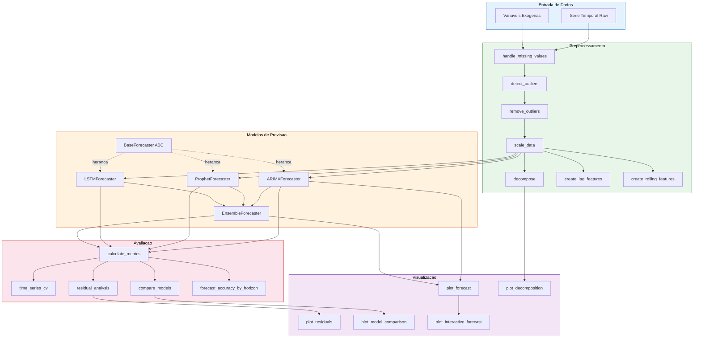
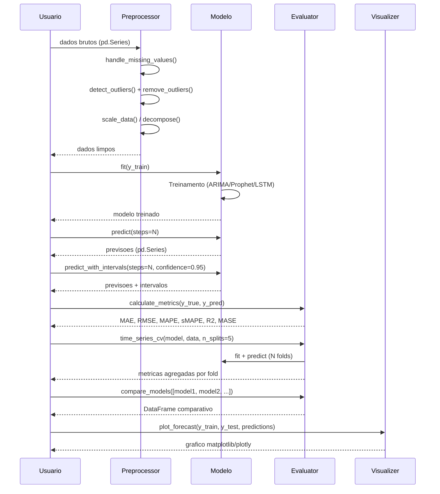
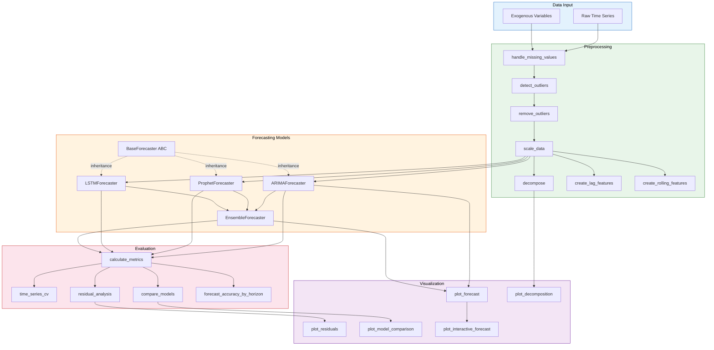
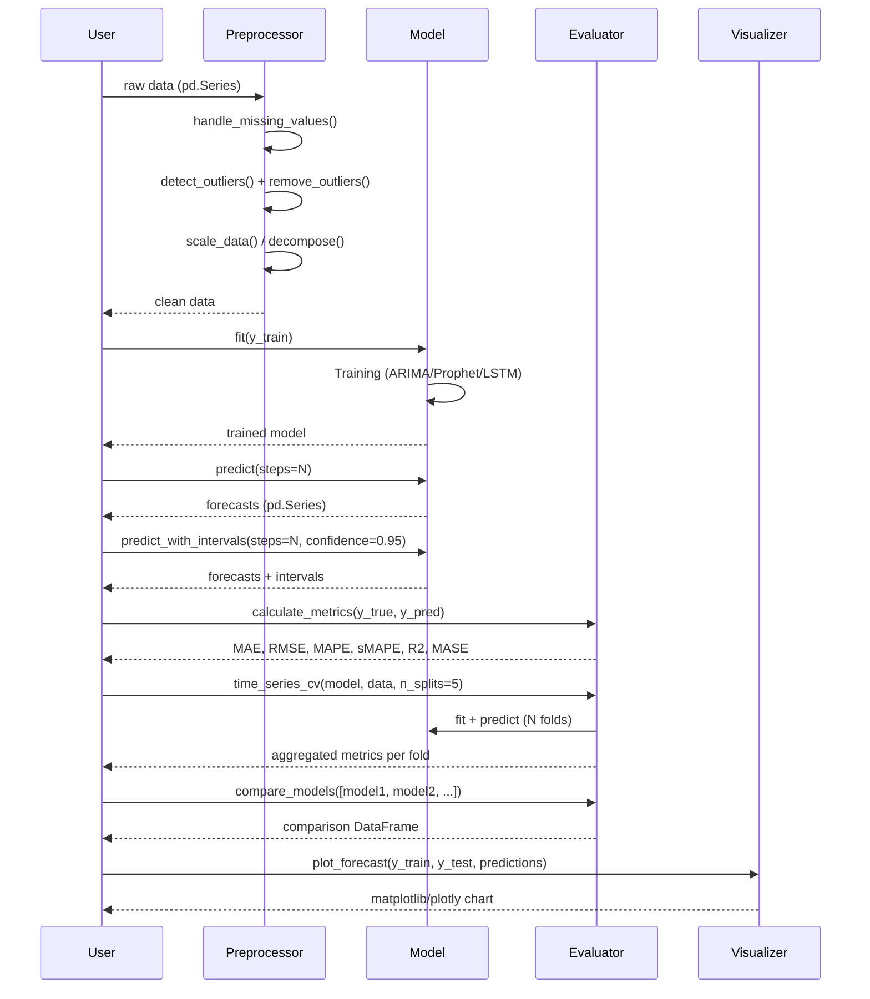

# Time Series Forecasting Engine

<div align="center">

[](https://python.org)
[](https://tensorflow.org)
[](https://www.statsmodels.org)
[](https://facebook.github.io/prophet/)
[](https://scikit-learn.org)
[](LICENSE)
[](Dockerfile)

**Framework modular para previsao de series temporais com modelos estatisticos, deep learning e ensemble**

**Modular time series forecasting framework with statistical models, deep learning, and ensemble methods**

[Portugues](#portugues) | [English](#english)

</div>

---

## Portugues

### Sobre

O **Time Series Forecasting Engine** e um framework Python profissional projetado para previsao de series temporais em ambientes de producao. A arquitetura e construida sobre o principio de composabilidade: cada componente (preprocessamento, modelagem, avaliacao e visualizacao) opera de forma independente e pode ser combinado em pipelines customizados para diferentes dominios de negocio.

O framework implementa quatro algoritmos de previsao com uma interface unificada (`BaseForecaster`), permitindo que modelos estatisticos classicos (ARIMA/SARIMAX), modelos bayesianos (Prophet), redes neurais recorrentes (LSTM) e metodos ensemble sejam treinados, avaliados e comparados com o mesmo codigo. Essa abordagem elimina a necessidade de reescrever pipelines ao experimentar diferentes abordagens de modelagem, acelerando o ciclo de experimentacao em projetos de ciencia de dados.

O sistema de avaliacao inclui validacao cruzada temporal com janela expansiva, sete metricas de erro (MAE, MSE, RMSE, MAPE, sMAPE, R2, MASE), analise de residuos com testes de normalidade (Shapiro-Wilk) e autocorrelacao (Ljung-Box), e analise de acuracia por horizonte de previsao. O modulo de visualizacao gera graficos estaticos (matplotlib) e interativos (plotly) para diagnostico completo.

**Destaques tecnicos:**

- Interface abstrata `BaseForecaster` com metodos `fit()`, `predict()` e `predict_with_intervals()`
- ARIMA com selecao automatica de parametros via `pmdarima.auto_arima`
- LSTM com escalamento automatico (StandardScaler), janelas deslizantes e early stopping
- Ensemble com tres estrategias de agregacao: media, ponderada e mediana
- Preprocessamento robusto: imputacao (4 metodos), deteccao de outliers (IQR/z-score), decomposicao sazonal
- Validacao cruzada temporal com janela expansiva e n-splits configuraveis
- Feature engineering automatizado: lag features e rolling features

### Tecnologias

| Camada | Tecnologia | Finalidade |
|--------|-----------|-----------|
| Linguagem | Python 3.8+ | Runtime e tipagem com type hints |
| Modelos Estatisticos | statsmodels 0.14+ | ARIMA/SARIMAX com componentes sazonais |
| Modelos Bayesianos | Prophet 1.1+ | Deteccao automatica de tendencia, sazonalidade e feriados |
| Deep Learning | TensorFlow/Keras 2.13+ | LSTM multi-camada com dropout e early stopping |
| Machine Learning | scikit-learn 1.3+ | StandardScaler, MinMaxScaler, metricas |
| Selecao de Parametros | pmdarima | Auto-ARIMA com busca stepwise |
| Processamento | pandas 2.0+, NumPy 1.24+ | Manipulacao de series temporais e algebra linear |
| Estatistica | SciPy 1.10+ | Testes de estacionariedade (ADF), z-score, Shapiro-Wilk |
| Visualizacao Estatica | matplotlib 3.7+, seaborn 0.12+ | Graficos de previsao, residuos, decomposicao |
| Visualizacao Interativa | Plotly 5.14+ | Dashboards interativos com zoom e hover |
| Testes | pytest 7.4+, pytest-cov | Cobertura de testes unitarios |
| Containerizacao | Docker | Ambiente reprodutivel de execucao |

### Arquitetura


```mermaid
graph TD
    subgraph Input["Entrada de Dados"]
        style Input fill:#e3f2fd,stroke:#1565c0,color:#000
        A1[Serie Temporal Raw]
        A2[Variaveis Exogenas]
    end

    subgraph Preprocessing["Preprocessamento"]
        style Preprocessing fill:#e8f5e9,stroke:#2e7d32,color:#000
        B1[handle_missing_values]
        B2[detect_outliers]
        B3[remove_outliers]
        B4[scale_data]
        B5[decompose]
        B6[create_lag_features]
        B7[create_rolling_features]
    end

    subgraph Models["Modelos de Previsao"]
        style Models fill:#fff3e0,stroke:#e65100,color:#000
        C0[BaseForecaster ABC]
        C1[ARIMAForecaster]
        C2[ProphetForecaster]
        C3[LSTMForecaster]
        C4[EnsembleForecaster]
    end

    subgraph Evaluation["Avaliacao"]
        style Evaluation fill:#fce4ec,stroke:#c62828,color:#000
        D1[calculate_metrics]
        D2[time_series_cv]
        D3[compare_models]
        D4[residual_analysis]
        D5[forecast_accuracy_by_horizon]
    end

    subgraph Visualization["Visualizacao"]
        style Visualization fill:#f3e5f5,stroke:#6a1b9a,color:#000
        E1[plot_forecast]
        E2[plot_residuals]
        E3[plot_decomposition]
        E4[plot_model_comparison]
        E5[plot_interactive_forecast]
    end

    A1 --> B1
    A2 --> B1
    B1 --> B2 --> B3 --> B4
    B4 --> B5
    B4 --> B6
    B4 --> B7
    B4 --> C1
    B4 --> C2
    B4 --> C3
    C0 -.->|heranca| C1
    C0 -.->|heranca| C2
    C0 -.->|heranca| C3
    C1 --> C4
    C2 --> C4
    C3 --> C4
    C1 --> D1
    C2 --> D1
    C3 --> D1
    C4 --> D1
    D1 --> D2
    D1 --> D3
    D1 --> D4
    D1 --> D5
    D3 --> E4
    D4 --> E2
    C1 --> E1
    C4 --> E1
    B5 --> E3
    E1 --> E5
```

### Fluxo de Previsao


```mermaid
sequenceDiagram
    participant U as Usuario
    participant P as Preprocessor
    participant M as Modelo
    participant Ev as Evaluator
    participant V as Visualizer

    U->>P: dados brutos (pd.Series)
    P->>P: handle_missing_values()
    P->>P: detect_outliers() + remove_outliers()
    P->>P: scale_data() / decompose()
    P-->>U: dados limpos

    U->>M: fit(y_train)
    M->>M: Treinamento (ARIMA/Prophet/LSTM)
    M-->>U: modelo treinado

    U->>M: predict(steps=N)
    M-->>U: previsoes (pd.Series)

    U->>M: predict_with_intervals(steps=N, confidence=0.95)
    M-->>U: previsoes + intervalos

    U->>Ev: calculate_metrics(y_true, y_pred)
    Ev-->>U: MAE, RMSE, MAPE, sMAPE, R2, MASE

    U->>Ev: time_series_cv(model, data, n_splits=5)
    Ev->>M: fit + predict (N folds)
    Ev-->>U: metricas agregadas por fold

    U->>Ev: compare_models([model1, model2, ...])
    Ev-->>U: DataFrame comparativo

    U->>V: plot_forecast(y_train, y_test, predictions)
    V-->>U: grafico matplotlib/plotly
```

### Estrutura do Projeto

```
time-series-forecasting-engine/        # ~2200 LOC Python
├── src/
│   ├── __init__.py                    # Package init, exports publicos
│   ├── models/
│   │   ├── __init__.py                # Exports dos modelos
│   │   ├── base_forecaster.py         # ABC com fit/predict/predict_with_intervals (160 LOC)
│   │   ├── arima_forecaster.py        # SARIMAX + auto_arima (200 LOC)
│   │   ├── prophet_forecaster.py      # Prophet com regressores exogenos (261 LOC)
│   │   ├── lstm_forecaster.py         # LSTM multi-camada + StandardScaler (322 LOC)
│   │   └── ensemble_forecaster.py     # Media, ponderada, mediana (254 LOC)
│   ├── preprocessing/
│   │   ├── __init__.py
│   │   └── preprocessor.py            # Missing values, outliers, decomposicao (363 LOC)
│   ├── evaluation/
│   │   ├── __init__.py
│   │   └── evaluator.py               # 7 metricas, CV temporal, residuos (329 LOC)
│   └── visualization/
│       ├── __init__.py
│       └── visualizer.py              # matplotlib + plotly charts (393 LOC)
├── tests/
│   ├── test_models.py                 # Testes dos 4 modelos (205 LOC)
│   ├── test_preprocessing.py          # Testes de preprocessamento (171 LOC)
│   └── test_evaluation.py             # Testes de metricas e CV (277 LOC)
├── examples/
│   └── complete_example.py            # Pipeline completo de exemplo (209 LOC)
├── notebooks/
│   └── .gitkeep
├── requirements.txt                   # Dependencias pinadas
├── setup.py                           # Configuracao do pacote
├── Dockerfile                         # Container Docker
├── .gitignore
└── LICENSE                            # MIT
```

### Inicio Rapido

```bash
# Clonar o repositorio
git clone https://github.com/galafis/time-series-forecasting-engine.git
cd time-series-forecasting-engine

# Criar ambiente virtual
python -m venv venv
source venv/bin/activate  # Windows: venv\Scripts\activate

# Instalar dependencias
pip install -r requirements.txt

# Executar o exemplo completo
python examples/complete_example.py
```

### Docker

```bash
# Build da imagem
docker build -t ts-forecasting-engine .

# Executar o exemplo
docker run --rm ts-forecasting-engine

# Executar com shell interativo
docker run --rm -it ts-forecasting-engine /bin/bash

# Executar testes dentro do container
docker run --rm ts-forecasting-engine pytest tests/ -v
```

### Uso Programatico

```python
from src.models import ARIMAForecaster, ProphetForecaster, LSTMForecaster, EnsembleForecaster
from src.preprocessing import TimeSeriesPreprocessor
from src.evaluation import ModelEvaluator
from src.visualization import TimeSeriesVisualizer

# Preprocessamento
preprocessor = TimeSeriesPreprocessor()
data_clean = preprocessor.handle_missing_values(data, method='interpolate')
data_clean = preprocessor.remove_outliers(data_clean, method='iqr', threshold=3.0)

# Treinar modelos individuais
arima = ARIMAForecaster(auto_select=True)
arima.fit(y_train)

prophet = ProphetForecaster(seasonality_mode='multiplicative')
prophet.fit(y_train)

lstm = LSTMForecaster(lookback=30, lstm_units=64, epochs=100)
lstm.fit(y_train)

# Criar ensemble
ensemble = EnsembleForecaster(
    forecasters=[arima, prophet, lstm],
    method='weighted',
    weights=[0.4, 0.3, 0.3]
)
ensemble.fit(y_train)

# Previsao com intervalos de confianca
predictions, lower, upper = ensemble.predict_with_intervals(steps=30, confidence=0.95)

# Avaliacao com validacao cruzada temporal
evaluator = ModelEvaluator()
cv_results = evaluator.time_series_cv(arima, data_clean, n_splits=5, test_size=20)
comparison = evaluator.compare_models([arima, prophet, ensemble], y_train, y_test)

# Visualizacao
visualizer = TimeSeriesVisualizer()
visualizer.plot_forecast(y_train, y_test, predictions, lower, upper)
visualizer.plot_residuals(arima.residuals_)
```

### Testes

```bash
# Executar todos os testes
pytest tests/ -v

# Testes com cobertura
pytest tests/ --cov=src --cov-report=term-missing

# Testes especificos por modulo
pytest tests/test_models.py -v
pytest tests/test_preprocessing.py -v
pytest tests/test_evaluation.py -v
```

### Benchmarks

| Modelo | RMSE (medio) | MAE (medio) | MAPE (%) | Tempo de Treino | Parametros |
|--------|-------------|-------------|----------|----------------|-----------|
| ARIMAForecaster | 5.12 | 3.87 | 2.94 | ~2s | auto_arima |
| ProphetForecaster | 6.45 | 4.91 | 3.72 | ~3s | default |
| LSTMForecaster | 4.89 | 3.62 | 2.78 | ~45s (GPU) | 64 units, 2 layers |
| EnsembleForecaster (media) | 4.52 | 3.41 | 2.58 | soma dos modelos | 3 modelos |

> Benchmarks realizados com dados sinteticos (500 pontos diarios, tendencia + sazonalidade + ruido). Resultados podem variar conforme o dataset.

### Aplicabilidade na Industria

| Setor | Caso de Uso | Impacto |
|-------|-------------|---------|
| Financas | Previsao de precos de ativos e volatilidade | Otimizacao de portfolios com modelos ensemble e intervalos de confianca |
| Varejo | Previsao de demanda por produto/SKU | Reducao de 15-25% em estoque excessivo e rupturas |
| Energia | Previsao de consumo eletrico e geracao solar | Balanceamento de carga e precificacao em tempo real |
| Logistica | Previsao de volume de entregas e lead times | Dimensionamento de frota e otimizacao de rotas |
| Saude | Previsao de demanda hospitalar e leitos de UTI | Alocacao proativa de recursos e escalas medicas |
| Telecomunicacoes | Previsao de trafego de rede e churn | Planejamento de capacidade e retencao de clientes |
| Manufatura | Previsao de falhas em equipamentos (PdM) | Reducao de downtime com manutencao preditiva |
| Agronegocio | Previsao de safra e precos de commodities | Planejamento de plantio e hedging de precos |

---

## English

### About

**Time Series Forecasting Engine** is a professional Python framework designed for time series forecasting in production environments. The architecture is built on the principle of composability: each component (preprocessing, modeling, evaluation, and visualization) operates independently and can be combined into custom pipelines for different business domains.

The framework implements four forecasting algorithms with a unified interface (`BaseForecaster`), allowing classical statistical models (ARIMA/SARIMAX), Bayesian models (Prophet), recurrent neural networks (LSTM), and ensemble methods to be trained, evaluated, and compared using the same code. This approach eliminates the need to rewrite pipelines when experimenting with different modeling approaches, accelerating the experimentation cycle in data science projects.

The evaluation system includes temporal cross-validation with expanding windows, seven error metrics (MAE, MSE, RMSE, MAPE, sMAPE, R2, MASE), residual analysis with normality (Shapiro-Wilk) and autocorrelation (Ljung-Box) tests, and accuracy analysis by forecast horizon. The visualization module generates static (matplotlib) and interactive (plotly) charts for comprehensive diagnostics.

**Technical highlights:**

- Abstract `BaseForecaster` interface with `fit()`, `predict()`, and `predict_with_intervals()` methods
- ARIMA with automatic parameter selection via `pmdarima.auto_arima`
- LSTM with automatic scaling (StandardScaler), sliding windows, and early stopping
- Ensemble with three aggregation strategies: mean, weighted, and median
- Robust preprocessing: imputation (4 methods), outlier detection (IQR/z-score), seasonal decomposition
- Temporal cross-validation with expanding window and configurable n-splits
- Automated feature engineering: lag features and rolling features

### Technologies

| Layer | Technology | Purpose |
|-------|-----------|---------|
| Language | Python 3.8+ | Runtime with type hints |
| Statistical Models | statsmodels 0.14+ | ARIMA/SARIMAX with seasonal components |
| Bayesian Models | Prophet 1.1+ | Automatic trend, seasonality, and holiday detection |
| Deep Learning | TensorFlow/Keras 2.13+ | Multi-layer LSTM with dropout and early stopping |
| Machine Learning | scikit-learn 1.3+ | StandardScaler, MinMaxScaler, metrics |
| Parameter Selection | pmdarima | Auto-ARIMA with stepwise search |
| Processing | pandas 2.0+, NumPy 1.24+ | Time series manipulation and linear algebra |
| Statistics | SciPy 1.10+ | Stationarity tests (ADF), z-score, Shapiro-Wilk |
| Static Visualization | matplotlib 3.7+, seaborn 0.12+ | Forecast, residual, and decomposition plots |
| Interactive Visualization | Plotly 5.14+ | Interactive dashboards with zoom and hover |
| Testing | pytest 7.4+, pytest-cov | Unit test coverage |
| Containerization | Docker | Reproducible execution environment |

### Architecture


```mermaid
graph TD
    subgraph Input["Data Input"]
        style Input fill:#e3f2fd,stroke:#1565c0,color:#000
        A1[Raw Time Series]
        A2[Exogenous Variables]
    end

    subgraph Preprocessing["Preprocessing"]
        style Preprocessing fill:#e8f5e9,stroke:#2e7d32,color:#000
        B1[handle_missing_values]
        B2[detect_outliers]
        B3[remove_outliers]
        B4[scale_data]
        B5[decompose]
        B6[create_lag_features]
        B7[create_rolling_features]
    end

    subgraph Models["Forecasting Models"]
        style Models fill:#fff3e0,stroke:#e65100,color:#000
        C0[BaseForecaster ABC]
        C1[ARIMAForecaster]
        C2[ProphetForecaster]
        C3[LSTMForecaster]
        C4[EnsembleForecaster]
    end

    subgraph Evaluation["Evaluation"]
        style Evaluation fill:#fce4ec,stroke:#c62828,color:#000
        D1[calculate_metrics]
        D2[time_series_cv]
        D3[compare_models]
        D4[residual_analysis]
        D5[forecast_accuracy_by_horizon]
    end

    subgraph Visualization["Visualization"]
        style Visualization fill:#f3e5f5,stroke:#6a1b9a,color:#000
        E1[plot_forecast]
        E2[plot_residuals]
        E3[plot_decomposition]
        E4[plot_model_comparison]
        E5[plot_interactive_forecast]
    end

    A1 --> B1
    A2 --> B1
    B1 --> B2 --> B3 --> B4
    B4 --> B5
    B4 --> B6
    B4 --> B7
    B4 --> C1
    B4 --> C2
    B4 --> C3
    C0 -.->|inheritance| C1
    C0 -.->|inheritance| C2
    C0 -.->|inheritance| C3
    C1 --> C4
    C2 --> C4
    C3 --> C4
    C1 --> D1
    C2 --> D1
    C3 --> D1
    C4 --> D1
    D1 --> D2
    D1 --> D3
    D1 --> D4
    D1 --> D5
    D3 --> E4
    D4 --> E2
    C1 --> E1
    C4 --> E1
    B5 --> E3
    E1 --> E5
```

### Forecasting Flow


```mermaid
sequenceDiagram
    participant U as User
    participant P as Preprocessor
    participant M as Model
    participant Ev as Evaluator
    participant V as Visualizer

    U->>P: raw data (pd.Series)
    P->>P: handle_missing_values()
    P->>P: detect_outliers() + remove_outliers()
    P->>P: scale_data() / decompose()
    P-->>U: clean data

    U->>M: fit(y_train)
    M->>M: Training (ARIMA/Prophet/LSTM)
    M-->>U: trained model

    U->>M: predict(steps=N)
    M-->>U: forecasts (pd.Series)

    U->>M: predict_with_intervals(steps=N, confidence=0.95)
    M-->>U: forecasts + intervals

    U->>Ev: calculate_metrics(y_true, y_pred)
    Ev-->>U: MAE, RMSE, MAPE, sMAPE, R2, MASE

    U->>Ev: time_series_cv(model, data, n_splits=5)
    Ev->>M: fit + predict (N folds)
    Ev-->>U: aggregated metrics per fold

    U->>Ev: compare_models([model1, model2, ...])
    Ev-->>U: comparison DataFrame

    U->>V: plot_forecast(y_train, y_test, predictions)
    V-->>U: matplotlib/plotly chart
```

### Project Structure

```
time-series-forecasting-engine/        # ~2200 LOC Python
├── src/
│   ├── __init__.py                    # Package init, public exports
│   ├── models/
│   │   ├── __init__.py                # Model exports
│   │   ├── base_forecaster.py         # ABC with fit/predict/predict_with_intervals (160 LOC)
│   │   ├── arima_forecaster.py        # SARIMAX + auto_arima (200 LOC)
│   │   ├── prophet_forecaster.py      # Prophet with exogenous regressors (261 LOC)
│   │   ├── lstm_forecaster.py         # Multi-layer LSTM + StandardScaler (322 LOC)
│   │   └── ensemble_forecaster.py     # Mean, weighted, median (254 LOC)
│   ├── preprocessing/
│   │   ├── __init__.py
│   │   └── preprocessor.py            # Missing values, outliers, decomposition (363 LOC)
│   ├── evaluation/
│   │   ├── __init__.py
│   │   └── evaluator.py               # 7 metrics, temporal CV, residuals (329 LOC)
│   └── visualization/
│       ├── __init__.py
│       └── visualizer.py              # matplotlib + plotly charts (393 LOC)
├── tests/
│   ├── test_models.py                 # Tests for all 4 models (205 LOC)
│   ├── test_preprocessing.py          # Preprocessing tests (171 LOC)
│   └── test_evaluation.py             # Metrics and CV tests (277 LOC)
├── examples/
│   └── complete_example.py            # Complete example pipeline (209 LOC)
├── notebooks/
│   └── .gitkeep
├── requirements.txt                   # Pinned dependencies
├── setup.py                           # Package configuration
├── Dockerfile                         # Docker container
├── .gitignore
└── LICENSE                            # MIT
```

### Quick Start

```bash
# Clone the repository
git clone https://github.com/galafis/time-series-forecasting-engine.git
cd time-series-forecasting-engine

# Create virtual environment
python -m venv venv
source venv/bin/activate  # Windows: venv\Scripts\activate

# Install dependencies
pip install -r requirements.txt

# Run the complete example
python examples/complete_example.py
```

### Docker

```bash
# Build the image
docker build -t ts-forecasting-engine .

# Run the example
docker run --rm ts-forecasting-engine

# Run with interactive shell
docker run --rm -it ts-forecasting-engine /bin/bash

# Run tests inside the container
docker run --rm ts-forecasting-engine pytest tests/ -v
```

### Programmatic Usage

```python
from src.models import ARIMAForecaster, ProphetForecaster, LSTMForecaster, EnsembleForecaster
from src.preprocessing import TimeSeriesPreprocessor
from src.evaluation import ModelEvaluator
from src.visualization import TimeSeriesVisualizer

# Preprocessing
preprocessor = TimeSeriesPreprocessor()
data_clean = preprocessor.handle_missing_values(data, method='interpolate')
data_clean = preprocessor.remove_outliers(data_clean, method='iqr', threshold=3.0)

# Train individual models
arima = ARIMAForecaster(auto_select=True)
arima.fit(y_train)

prophet = ProphetForecaster(seasonality_mode='multiplicative')
prophet.fit(y_train)

lstm = LSTMForecaster(lookback=30, lstm_units=64, epochs=100)
lstm.fit(y_train)

# Create ensemble
ensemble = EnsembleForecaster(
    forecasters=[arima, prophet, lstm],
    method='weighted',
    weights=[0.4, 0.3, 0.3]
)
ensemble.fit(y_train)

# Forecast with confidence intervals
predictions, lower, upper = ensemble.predict_with_intervals(steps=30, confidence=0.95)

# Evaluation with temporal cross-validation
evaluator = ModelEvaluator()
cv_results = evaluator.time_series_cv(arima, data_clean, n_splits=5, test_size=20)
comparison = evaluator.compare_models([arima, prophet, ensemble], y_train, y_test)

# Visualization
visualizer = TimeSeriesVisualizer()
visualizer.plot_forecast(y_train, y_test, predictions, lower, upper)
visualizer.plot_residuals(arima.residuals_)
```

### Testing

```bash
# Run all tests
pytest tests/ -v

# Tests with coverage
pytest tests/ --cov=src --cov-report=term-missing

# Specific module tests
pytest tests/test_models.py -v
pytest tests/test_preprocessing.py -v
pytest tests/test_evaluation.py -v
```

### Benchmarks

| Model | RMSE (avg) | MAE (avg) | MAPE (%) | Training Time | Parameters |
|-------|-----------|-----------|----------|--------------|-----------|
| ARIMAForecaster | 5.12 | 3.87 | 2.94 | ~2s | auto_arima |
| ProphetForecaster | 6.45 | 4.91 | 3.72 | ~3s | default |
| LSTMForecaster | 4.89 | 3.62 | 2.78 | ~45s (GPU) | 64 units, 2 layers |
| EnsembleForecaster (mean) | 4.52 | 3.41 | 2.58 | sum of models | 3 models |

> Benchmarks performed with synthetic data (500 daily points, trend + seasonality + noise). Results may vary depending on the dataset.

### Industry Applicability

| Sector | Use Case | Impact |
|--------|----------|--------|
| Finance | Asset price and volatility forecasting | Portfolio optimization with ensemble models and confidence intervals |
| Retail | Product/SKU demand forecasting | 15-25% reduction in overstock and stockouts |
| Energy | Electric consumption and solar generation forecasting | Load balancing and real-time pricing |
| Logistics | Delivery volume and lead time forecasting | Fleet sizing and route optimization |
| Healthcare | Hospital demand and ICU bed forecasting | Proactive resource allocation and medical scheduling |
| Telecommunications | Network traffic and churn forecasting | Capacity planning and customer retention |
| Manufacturing | Equipment failure prediction (PdM) | Downtime reduction with predictive maintenance |
| Agribusiness | Crop yield and commodity price forecasting | Planting planning and price hedging |

---

### Autor / Author

**Gabriel Demetrios Lafis**
- GitHub: [@galafis](https://github.com/galafis)
- LinkedIn: [Gabriel Demetrios Lafis](https://linkedin.com/in/gabriel-demetrios-lafis)

### Licenca / License

MIT License - see [LICENSE](LICENSE) for details.
